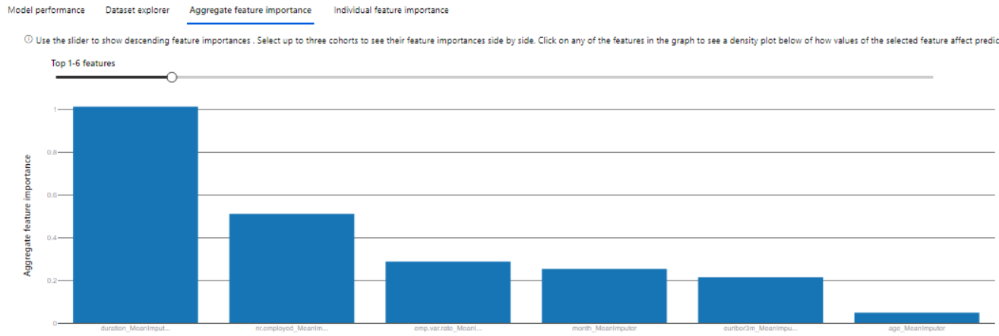
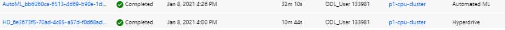

# Optimizing an ML Pipeline in Azure

## Overview
This project is part of the Udacity Azure ML Nanodegree.
In this project, we build and optimize an Azure ML pipeline using the Python SDK and a provided Scikit-learn model.
This model is then compared to an Azure AutoML run.

## Summary

This dataset contains data about clients of a bank in 3 main categories:
* **Personal information**: Occupation, age, marital status and education.


* **Financial information**: Debts and other data about customer's financial health.


* **Target**: The variable we seek to predict is the one that tells us if a given person is a potential client or not.
 


**Solution**

* The best performing model was a **Voting Ensemble Classifier** obtained using Azure AutoML. The accuracy reached, using Cross Validation with 7 folds was 0.9166.


* Apart of that, the same problem was tried to be solved using a *Logistic Regression* and *Azure HyperDrive* but the results were slightly worst (0.9164). 


## Scikit-learn Pipeline

* **Data**: A brief explanation about the data used is shown in the previous section. In this one the focus will be on its manipulation:
    1. In *train.py*, data is loaded from a csv using `TabularDatasetFactory`. 
    2. Data is cleaned using a function that removes missing values and convert categorical data in dummies or using label encoding.
    3. Split data in train and test.
    4. Using `scikit-learn`'s `LogisticRegressionClassifier` with the maximum number of iterations (`max_iter`; discrete) and the regularisation parameter `C`, which is continuous.

* **Hyperparameter Tuning**: `train.py` accepts `max_iter` and `C` as script arguments. This is important in order to optimise them using `Azure Hyperdrive`. A higher number of iterations or a high value of `C` (inversely proportional to regularization) can lead to overfitting so it's important to find a good tradeoff between both of them. Default values: `max_iter` equal to 100 and `C` equal to 1.

* **Classification Algorithm**: `scikit-learn` is the most popular machine learning library for Python. It contains a huge variety of classification algorithms. Among them, Logistic Regression has been the chosen one because, although it's not the most powerful, it is one of the most explainable and easy to tune (not so many hyperparameters).


**HyperDrive Configuration**

**Steps**
1. Select Parameter Sampler
2. Define a Policy
3. Create a `scikit-learn` estimator corresponding to the directives in `train.py`.
4. Define a `HyperDriveConfig` that aims to maximise accuracy with less than 10 runs and 4 concurrent at most because we have 4 nodes in the cluster at most.
5. Submit the job and review the results.
6. Register the model with `.register_model()`. 

* **Parameter sampler**: The parameter sampler I chose was `RandomParameterSampling` because it accepts both discrete and continuous hyperparameters. For `C`, a uniform distribution choice was made in a range between 0.05 an 1, while for `max_iter`, a random discrete choice was used.

* **Early Stopping Policy**: The Policy chosen is `Bandit Policy`. This one tries to avoid unnecessary runs by comparing the metric obtained during a set of runs and, if it's much worst than the best one (given an `slack factor`), then there`s no more runs.


## AutoML

The steps to run AutoML were:

1. Read data with `TabularDatasetFactory`, clean and save.
2. Use `AutoMLConfig` for configuration.
3. Fixed a timeout of *30 minutes* to avoid long runs that could incur in high expenses.
4. Selected *classification* as task and *accuracy* as maximising metric.
5. For validation, 7 folds CV is chosen with early stopping.
6. The job is submitted to compute cluster.
7. The best model is selected using `.get_best_child()` method to obtain the best child run.

8. The model is registered using `.register_model()` with the best run.
9. Model explanation is run and feature importance analysed.




## Pipeline comparison

**HyperDrive**
```
C = .54
max_iter = 25
accuracy = 0.9164
```


**AutoML**
```
accuracy = 0.9166
```


**Comparison**

Both have similar accuracy with the current configurations. AutoML carries out to a slightly better accuracy and provides us a lot of explainability and metrics information. However, it's much more expensive in terms of computation (32 minutes versus 10).



For a first run I think AutoML is the best option given that we have a good starting point and we can make an idea about the most important metrics, 
some candidate algorithms and model explainability.

However, after that, I think that the best option is to design a customized solution using HyperDrive, because:
* Performance can be improved easily.
* It is much more flexible.
* We can experiment in our local machine without incurring costs.
* Computationally is much more efficient.

## Future work
**What are some areas of improvement for future experiments? Why might these improvements help the model?**
We can see that the classes are unbalanced, i.e., there isn't the same amount of both (`yes` and `no`).


In this cases, using `accuracy` as the optimized metric is not always a good idea, because a high accuracy can mean that we are doing well only with the majoritarian class. If we check the confusion matrix obtained from AutoML, we see that this is the case:


To avoid this, there are techniques like, for example, resampling. However, the most immediate solution can be to change the optimised metric to another that can be fairer with minority class. This is the case of the **macro** metrics. If we have a look to these in AutoML results:


My proposal is either **changing the metric to maximize** to a macro one or trying to **fix unbalancing problems** by resampling (under or oversampling) the data.

## Proof of cluster clean up

